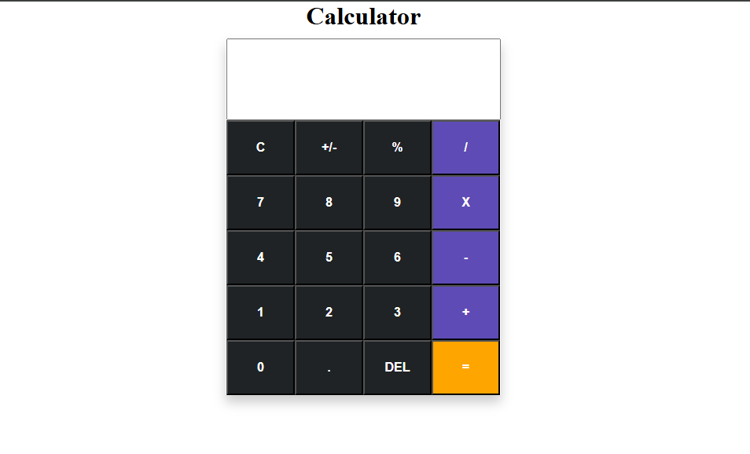

# Calculator

This is a simple calculator application built with HTML, CSS, JavaScript, and jQuery. The calculator performs basic arithmetic operations and has an intuitive, responsive design.

## Features

- **Basic Arithmetic Operations**: Supports addition, subtraction, multiplication, and division.
- **Responsive Layout**: Works on various screen sizes, including mobile.
- **Interactive Buttons**: Styled and functional buttons with jQuery event handling.
- **Clear and Backspace Functions**: Easily clear input or remove the last entry.

## Technologies Used

- **HTML**: Structure of the calculator.
- **CSS**: Styling for buttons, layout, and responsiveness.
- **JavaScript & jQuery**: Logic for handling calculations and button interactions.

